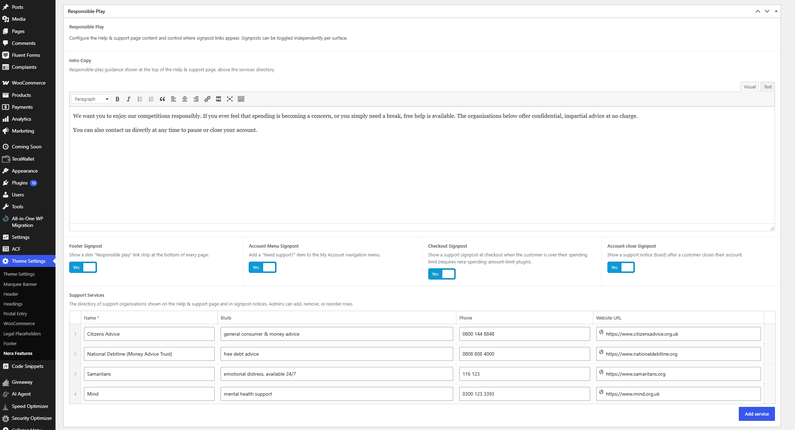
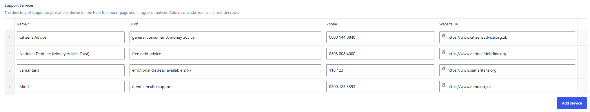
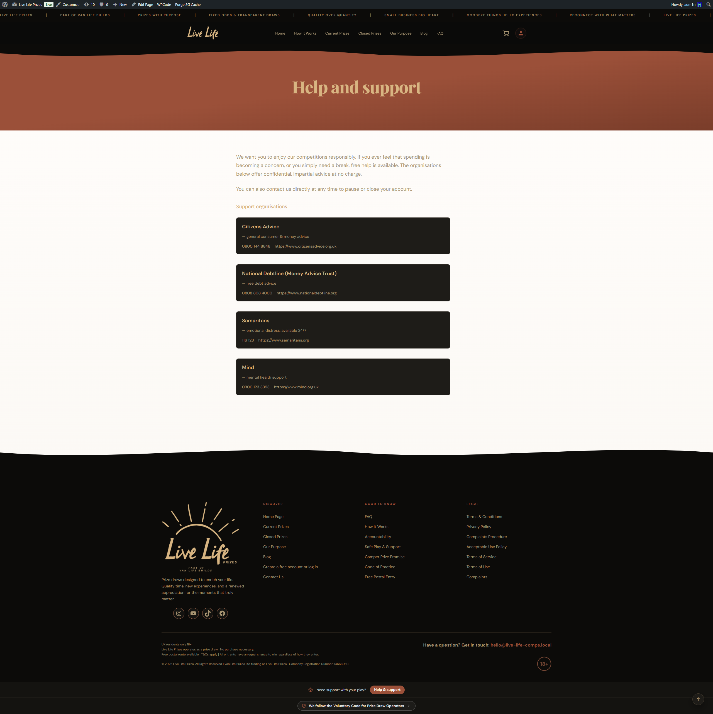
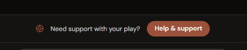
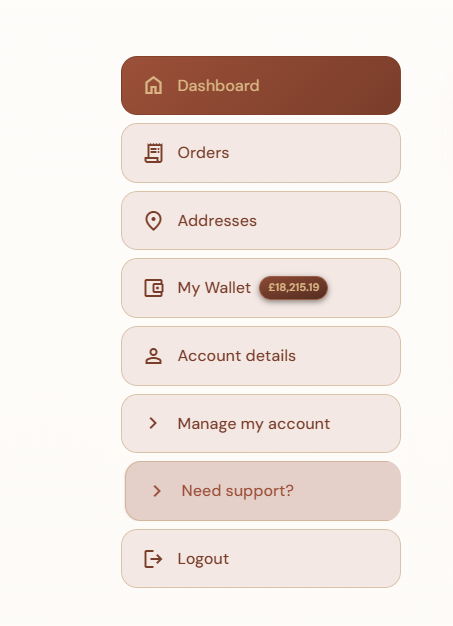
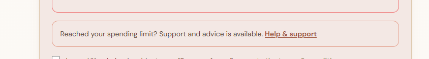

# Responsible Play — Guide for Site Administrators

This guide is for **site administrators and support staff** on Live Life Prizes. It explains how the responsible-play support signposting works, where customers see it, and how to keep the support information up to date.

You don't need any technical knowledge to use it — everything is done from the normal WordPress admin.

---

## What responsible play does

Responsible-gambling guidance asks sites to make it easy for customers to find support. This feature does that by:

- Creating a public **Help and support page** that lists free, confidential support organisations (with a short intro message above them).
- **Signposting** that page in four places around the site, so a customer who needs help can always find it.

You edit the support information **once** in the admin, and it appears everywhere automatically.

---

## Setting it up (one-time)

Everything is under **Theme Settings → Nera Features → Responsible Play**.

*The Responsible Play settings under Theme Settings → Nera Features.*

On activation the site already:

- **Created the Help and support page** for you (at `/help-and-support`), and
- **Added four default support organisations** (Citizens Advice, National Debtline, Samaritans, Mind).

So the main setup job is simply to **review and correct** those details for your site.

### Edit the intro message

The **Intro Copy** box is a normal text editor. Whatever you write here appears at the top of the Help page, above the list of organisations. Use it to add your own words and any direct contact details.

### Edit the list of support organisations

The **Support Services** list is where you add, remove, or reorder the organisations shown to customers. Each one has a **name**, a short **description**, a **phone number** (tap-to-call on phones), and a **website**.

*The editable list of support organisations.*

> ⚠️ **Please check the phone numbers** before going live — the four defaults are a starting point and should be confirmed.

### Choose where the support link appears

Four on/off switches control where the support signpost shows (all are **on** by default):

| Switch | Where it shows |
|---|---|
| **Footer Signpost** | A slim "Need support with your play?" strip at the bottom of every page. |
| **Account Menu Signpost** | A "Need support?" link in the customer's account menu. |
| **Checkout Signpost** | A support note at checkout, shown only if a customer has gone over a spending limit they set. |
| **Account-close Signpost** | A support message shown after a customer closes their account. |

### Check the Help page

Make sure the **Help and support** page appears under **Pages** and is published. Add a link to it in your footer or help menu too, so it's always easy to reach.

*The public Help and support page — your intro message plus the list of organisations.*

---

## Where customers see the support link

### Footer strip

A slim strip near the bottom of every page: **"Need support with your play?" → Help & support**.

*The support strip shown at the foot of every page.*

### Account menu

A **"Need support?"** link in the customer's account menu, next to Log out.

*The "Need support?" link added to the account menu.*

### At checkout (only if over a spending limit)

If a customer has set themselves a spending limit and their basket takes them over it, a short support note appears at checkout. This one relies on the separate **spending-limit** feature — if a customer hasn't set a limit, nothing shows here, which is normal.

*The support note shown at checkout when a customer is over their spending limit.*

---

## What customers see on the Help page

- Your **intro message** at the top.
- A clear **list of support organisations**, each with a tap-to-call phone number and a link to their website.

It's the same information everywhere — the footer link, the account menu, the checkout note, and the account-close message all point customers to (or show) this list.

---

## Common support questions

**"Where do I change the support organisations or phone numbers?"**
Theme Settings → Nera Features → Responsible Play → **Support Services**. One edit updates the Help page and every signpost.

**"The footer strip or account link isn't showing."**
Check that switch is turned on, and that the **Help and support** page is published (under Pages).

**"The checkout support note never appears."**
It only shows when a customer has set a spending limit and gone over it — it's a targeted nudge, not an always-on banner. If no limit is set, nothing shows, which is expected.

**"Can I turn one of these off?"**
Yes — each of the four signposts has its own on/off switch. The Help page itself always stays available.

**"The Help page got deleted — do I need to recreate it?"**
No. The site automatically recreates it. If it still doesn't appear, contact us.

**"Will my edits be lost when the plugin updates?"**
No. Your intro message and organisation list are saved with your site.

---

## Quick reference for support staff

- There's a public **Help and support** page (`/help-and-support`) listing free support organisations.
- Customers reach it from a **footer strip**, an **account-menu link**, a **checkout note** (only when over a spending limit), and a **message after closing an account**.
- Edit the intro message and the organisations under **Theme Settings → Nera Features → Responsible Play** — one edit updates everywhere.
- Each of the four signposts can be **switched on or off** independently.
- **Check the phone numbers** are correct before launch.

---

*Guide for the Nera Responsible Play feature on Live Life Prizes. Add the screenshots and adjust wording to match your site before sharing with staff.*
